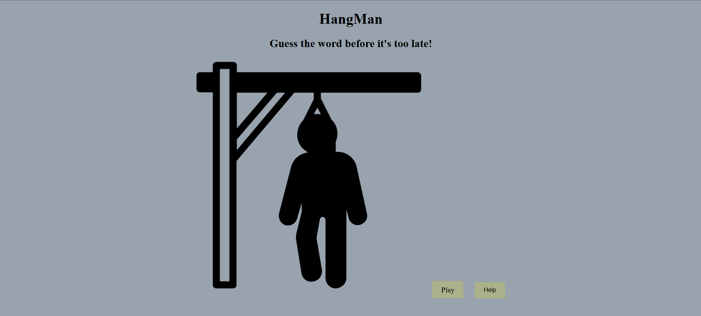

#  Hangman Game 

## 🕹️ Description

The game is built using HTML, CSS, and JavaScript.  
The player guesses letters to figure out the hidden word.  
With every wrong guess, a part of the stickman appears.  
You lose after 6 mistakes, or win by guessing the word. 

## 🚀 Getting Started 

👉 **Play it here:** [https://alabbad74.github.io/js-HangMan-Project/](https://alabbad74.github.io/js-HangMan-Project/)

## 🎮 How to Play

1. Click “Play” to start the game.
2. Type letters in the input box.
3. Use the Hint button if needed.
4. Use the Reset button to start again.
5. Click Help to view instructions. 

---

## 💡 Features

- ✅ Random word from a list of names  
- ✅ Letter-by-letter guessing  
- ✅ Win / Lose logic  
- ✅ Stickman drawing on each wrong guess  
- ✅ Hint button  
- ✅ Help popup  
- ✅ Reset button  

## 🧰 Technologies Used

- HTML  
- CSS  
- JavaScript  

